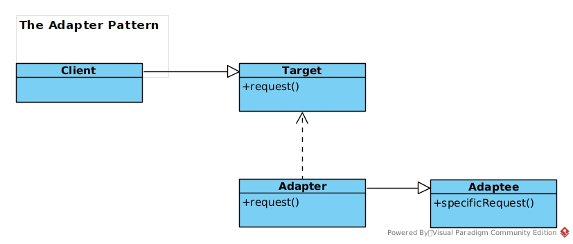
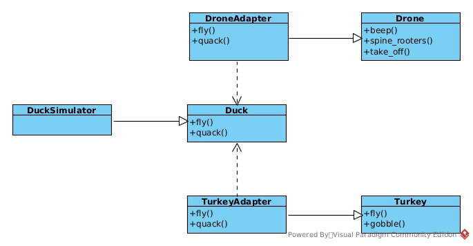

# The Adapter Pattern

This pattern convert an interface of a class into another interface that client expects.

##### Adapter uses Composite

- The client is composed with the target interface
- The adapter is composed with the adaptee
- The adapter delegates calls to adaptee and return necessary value
- The Client and the Adapter do not know about adapter in between them

### Adapter Pattern Diagram

### Implmentation of Duck Simulator with Adapter Pattern

Here, we created Turkey Adapter to implement the Duck interface without making changes to the Turkey interface. We also implmented Drone Adapter to use the Duck interface. This pattern enhance flexibility and comply with open-closed principle.

