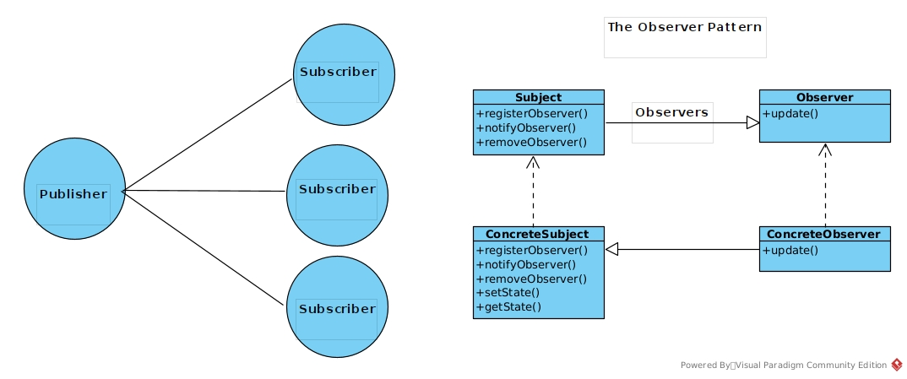

# The Observer Pattern

This pattern defines one-to-many dependency between objects so that when one object state change, all its dependants are notified and updated automatically

Subject and Observer interact with each other which makes them coupled, however they have little knowledge about each other which make them loosly coupled.

The observer pattern makes our design loosly coupled.

