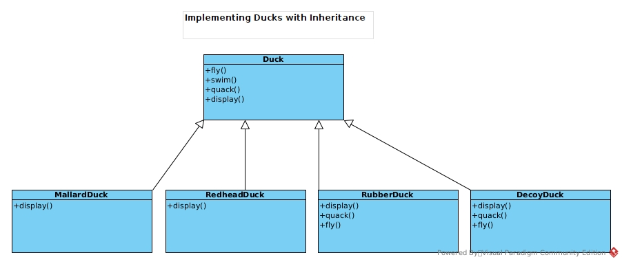
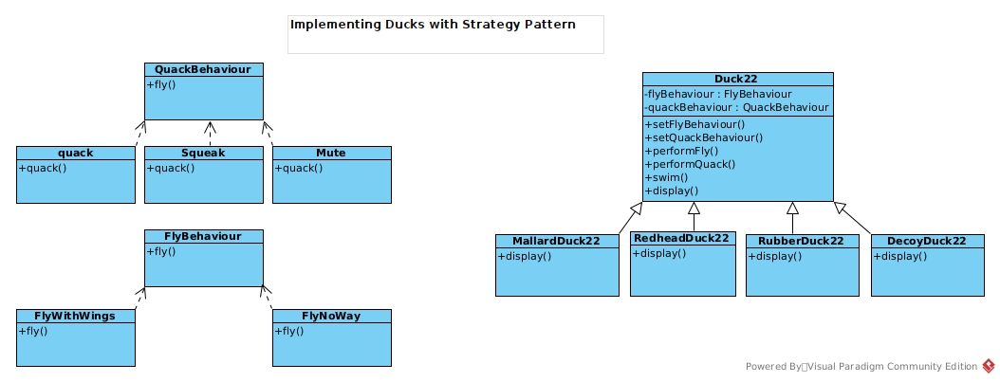

# Implementing Duck with Strategy Pattern

## Implementing Ducks with inheritance

Inheritance didn't work well

- Behaviour change across subclasses and some subclasses do not need some behaviour

## Implementing Ducks with interface

Interface didn't work well

- Interface does not supply implmentation, hence, destroy code reuse

## Implementing Ducks with Strategy Pattern

